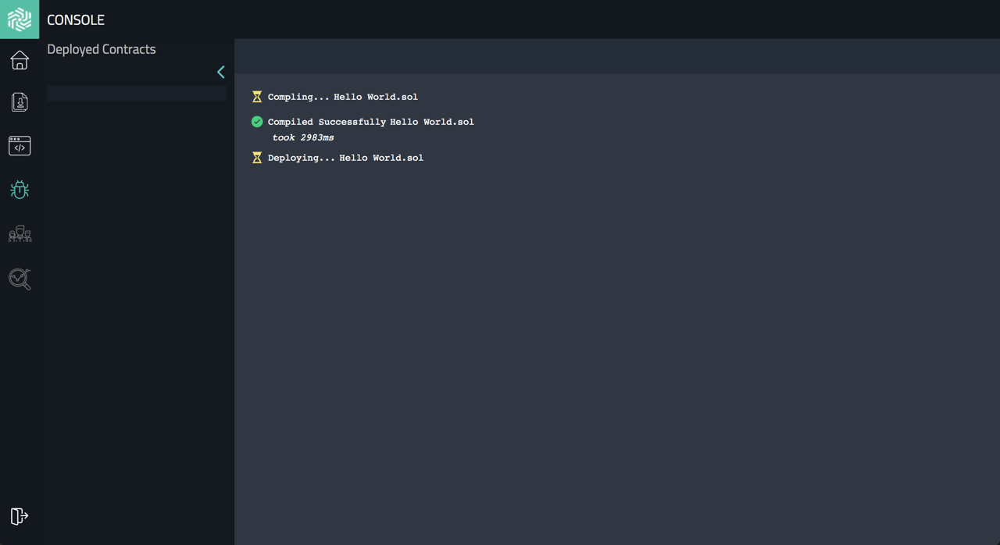

# TUTORIAL ON HOW TO DEPLOY SMART CONTRACTS ON HEDERA™ HASHGRAPH NETWORK USING CONSOLE

## Introduction
Hedera™ Hashgraph is the third generation public ledger with fast transaction speeds (3-5 seconds) and low bandwidth consumption.

The main purpose of this tutorial is that you quickly learn the entire process for deploying smart contracts for Hedera Hashgraph. 
A process that is very easy and intuitive if you use Console and Composer, the suite of tools from Hashing Systems.

Let's get started, you should be set under 30 minutes.

## 1 - Install the Composer browser extension
Composer is the payments solution that provides you with a Hedera account and connects smart contracts to your account. In an easy way, Composer allows interacting with the distributed ledger from the browser onboarding users without a hassle. It is like Metamask for Ethereum.
Composer is for free and it does not charge any fees.

Composer is distributed as a browser extension currently available on Chrome and Brave.

We will use the Chrome extension for this tutorial, you can find it here [Composer from Hashing Systems](https://chrome.google.com/webstore/detail/composer-for-hedera-hashg/hdjnnemgikeoehneddegfcmkljenlean "Composer Chrome extension")

To enter and interact with the Hedera network you require a Hedera account and some cryptocurrency.
In the next step, you will learn how to get a Hedera account.

## 2 - Register and Account setup
The faster way to get a Hedera account is through Composer. 

Once you have the Composer extension installed, you need to sign in with your Google account. 

This process links your Google account to a Hedera account, and give you an account ID.

A Hedera account ID is what you need to identify yourself in any interaction on the Hedera network, including access to the mainnet or testnet, deploying a smart contract, and keep your cryptocurrency. 

## 3 - Getting HBAR and transferring to your Account
As you know from the previous step, once you have a Hedera account ID, cryptocurrency is what allows you to act on the network. Hedera's cryptocurrency is hbar (HBAR).

But where to buy hbar coins? 
You can buy hbar through any of the major crypto exchanges.

In the case of Binance, it was very clear and smooth the process of getting hbar and transfer it directly to the account created from the Composer for this tutorial.

As you can see, the account ID from Composer now has some balance that will be needed to interact with the Hedera mainnet network and deploy the contract which is the goal of this tutorial.

If you would prefer to use the testnet, you can also create an account on the testnet.

## 4 - Environment setup: the Console
There are different options to deploy a smart contract in Hedera such as using Eclipse or IntelliJ but the easiest and straightforward is the Console from Hashing Systems.

Go to the Console (also called Deployer) here [Console from Hashing Systems](https://console.hashingsystems.com/ "Console from Hashing Systems")

The Console is the integrated development environment that makes easy to build, deploy, and track smart contracts directly from the web browser. The Console is like Remix and Studio for Ethereum and also uses Solidity, the most common smart contract language in use today.

You will find different tabs on the left side. 

The `Templates` tab will provide us some smart contract samples already set up.
You can also select an empty project to write your own smart contract from scratch.

The `File Explorer` tab will help you to see all the files in your project, create new files, upload files from a folder, and delete files.

New features will be added in the future such as `Team` and `Analytics`.

## 5 - Write a Smart Contract
You can start writing smart contracts right now, but this tutorial follows the tradition of programming with a "Hello World" smart contract.

In the `Templates` tab, there is a `Select Template` menu, let's choose `Hello World`.

This is a simple but interesting smart contract that will greet us with a message that you can change. 
As a quick summary it provides an argument to a constructor, stores state and fetches it.

Now that we have a smart contract, it is time to look into how to deploy it in the Hedera network.

## 6 - Deploy a Smart Contract
Before deploying a smart contract make sure you use the correct network set up in Composer (mainnet or testnet) and enough hbar to deploy.

Now click on Deploy. 

And accept the transaction with the fees (including gas cost). 

Find more information on fees and gas in Hedera network in the following links.

As you can see, the deployment starts with compiling the smart contract.

Once the contract compiles, you can then make construct inputs. 
In this tutorial, it is "Hello World".

You can manage your contract in the Contracts tab.

Congratulations! 
You've just deployed your first smart contract on the Hedera Hashgraph.

Now, you know everything needed to deploy smart contracts on Hedera using Console and Composer.
Enjoy Hedera!